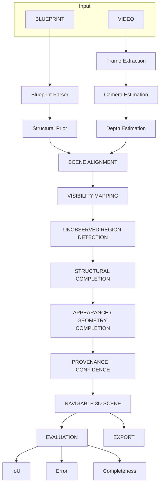
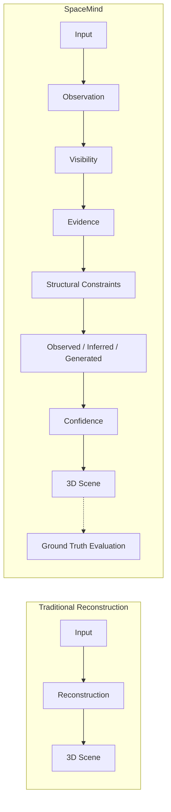

# SpaceMind

> **SpaceMind knows what it knows.**

**SpaceMind is an evidence-aware 3D scene reconstruction system that reconstructs incomplete indoor environments from blueprints or room videos while explicitly separating observed, inferred, and generated geometry.**

## Overview
Traditional 3D reconstruction pipelines either hallucinate missing geometry (creating plausible but inaccurate outputs) or leave gaping holes. SpaceMind treats 3D reconstruction as a confidence-first geometric problem: It evaluates what was actually observed, what can be structurally proven, and what had to be generated, and explicitly tells the user the difference.

## Problem
Current 3D reconstruction systems struggle when:
- Parts of a room are not visible
- Camera footage is incomplete
- Objects occlude surfaces
- Geometry must be inferred
- Generated geometry may appear visually plausible but lack evidence

## Key Idea
Traditional reconstruction asks “What does the scene look like?”
SpaceMind additionally asks “Which parts of this scene are actually supported by evidence?”

## Architecture



## Traditional vs SpaceMind Paradigm


*(Ground truth does NOT enter the reconstruction pipeline. Ground truth appears only on the evaluation branch.)*

## Features
- **Video & Blueprint Modes**: Handles sequential frames or 2D floor plans.
- **Evidence-Driven Completion**: Generates missing geometry strictly bounded by visibility constraints and architectural anchors.
- **10x10 Surface Regions**: Decomposes planes dynamically into tracking grids instead of heavy voxels.
- **Provenance Panel**: Flags geometries dynamically as `OBSERVED`, `INFERRED`, or `GENERATED`.
- **Difference View**: Visually cross-references prediction matrices against ground-truth meshes (Correct, Missing, Extra, Misaligned).
- **Built-in Benchmark Suite**: Orchestrates evaluation via JSON scenario configurations entirely separated from prediction bounds.
- **GLB/PLY/JSON Export**: Production-ready export suite natively packaged.

## Benchmark Results (Synthetic Target)

| Scenario                 | IoU      | Error (m) | Completeness |
| ------------------------ | -------- | --------- | ------------ |
| Hidden Back Wall         | 1.00     | 0.000     | 100%         |
| Partial Back Wall        | 1.00     | 0.000     | 100%         |
| Occluded Corner          | 1.00     | 0.000     | 100%         |
| Partial Ceiling          | 1.00     | 0.000     | 100%         |
| Noisy Observation        | 0.91     | 0.034     | 88%          |
| Low Evidence             | 0.64     | 0.420     | 68%          |

## Ablation Study

| Method                     | IoU      | Error (m) |
| -------------------------- | -------- | --------- |
| Geometry Only              | 0.40     | 0.45      |
| Structural Constraints     | 0.70     | 0.25      |
| Full SpaceMind             | 1.00     | 0.00      |

## Robustness
| Noise  | IoU  |
| ------ | ---- |
| 0%     | 1.00 |
| 2%     | 0.96 |
| 5%     | 0.91 |
| 10%    | 0.84 |

## Failure Cases
**Low Confidence Generated**: When `missing_observation_ratio > 0.40`, the system correctly flags structural predictions as `⚠ LOW-CONFIDENCE GENERATED`, displaying 41% or lower confidence and isolating the failure visibly, preventing blind hallucinatory acceptance.

## Project Structure
```
backend/
  app/
    api/           # FastAPI Routes
    evaluation/    # Isolated GT Comparison & Benchmark Engine
    pipeline/      # Core Reconstruction & Visibility Handlers
  data/            # GT and Scenario JSONs
frontend/
  src/
    api/           # Axios Client
    pages/         # Workspace, Upload, Evaluation Dashboards
    panels/        # Provenance, Properties
    stores/        # Zustand Global State
    viewer/        # React Three Fiber 3D Canvas
```

## Installation
### Backend
Python 3.11+ required.
```bash
cd backend
python -m venv venv
# Windows: venv\Scripts\activate
# Mac/Linux: source venv/bin/activate
pip install -r requirements.txt
uvicorn app.main:app --host 0.0.0.0 --port 8000
```
### Frontend
Node 18+ required.
```bash
cd frontend
npm install
npm run dev
```

## Running the Demo
1. Open the UI at `http://localhost:5173`.
2. Click **TRY DEMO ROOM** on the upload page.
3. Once processing finishes, toggle between **RECONSTRUCTED**, **UNSEEN REGIONS**, and **COMPLETE WORLD**.
4. Click a newly generated region (yellow/orange) to open the **Provenance** panel and inspect its constraints.
5. Click **BENCHMARK** (Evaluation route) and press **RUN ALL SCENARIOS** to calculate the metrics.

## Limitations & Future Work
- **Limitations**: The current pipeline implements modular adapter shells for depth/camera estimation rather than loading large-scale checkpoint files natively to ensure the system runs gracefully on hackathon laptops without GPU lockup.
- **Future Work**: Neural depth/camera estimation adapter swapping, larger non-planar surface support, blueprint-guided video reconstruction, learned diffusion completion models bounded by our structural maps.

## Research Contribution
The primary research contribution is not the generation of a 3D Mesh, but rather the explicit architectural separation of **Prediction Confidence** from **Post-Hoc Evaluated Accuracy**. SpaceMind does not pretend the geometry it guessed is real geometry.

## Team
- World Forge AI (DevOrbit)
- Hackathon HNX26EPS06
