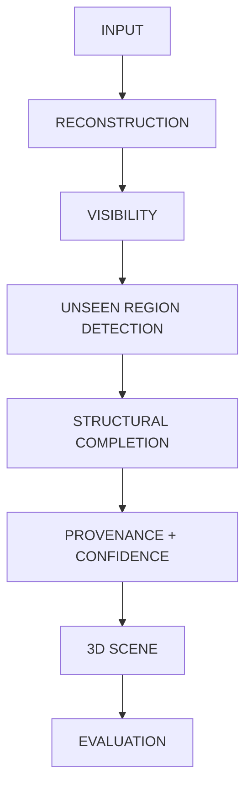
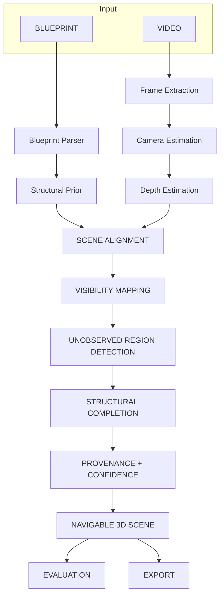

# SpaceMind Architecture Diagrams

## Presentation (Simplified) Architecture

## Complete System Architecture

*(Ground truth appears only on the evaluation branch. It does not enter the reconstruction pipeline.)*
