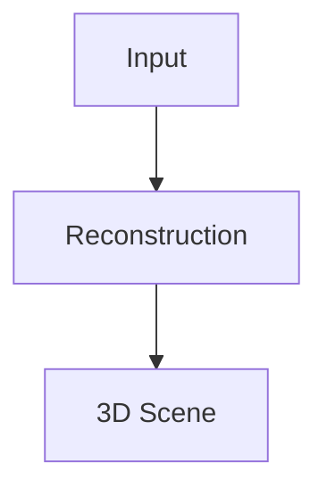
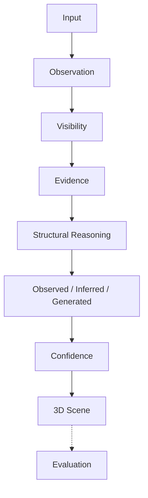

# Why SpaceMind?

> **The difference is not only generating geometry — it is representing the evidence behind that geometry.**

## Traditional Pipeline

```mermaid
flowchart TD
    A[Input] --> B[Reconstruction]
    B --> C[3D Scene]
```

## SpaceMind Paradigm

```mermaid
flowchart TD
    A[Input] --> B[Observation]
    B --> C[Visibility]
    C --> D[Evidence]
    D --> E[Structural Reasoning]
    E --> F[Observed / Inferred / Generated]
    F --> G[Confidence]
    G --> H[3D Scene]
    H -.-> I[Evaluation]
```
